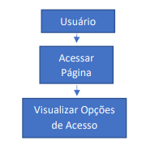

# Fluxo de Trabalho para Aceitação pelo QA e Cliente: Garantindo a Clareza na Página de Login de uma Loja Virtual

Ao conceber e desenvolver uma loja virtual, é essencial garantir que a página de login seja clara e eficaz, oferecendo aos usuários uma experiência positiva. O processo de construção e aceitação da página de login envolve a colaboração entre a equipe de desenvolvimento, Garantia de Qualidade (QA) e o cliente. Este documento descreve o fluxo de trabalho desde a concepção da História de Usuário até a aceitação pelo cliente.

## História de Usuário: Acesso à Página de Login em uma Loja Virtual

A História de Usuário é o ponto de partida, descrevendo a necessidade do usuário de acessar a página de login. Os critérios de aceitação estabelecem os padrões que a página deve atender.

  

**Critérios de Aceitação:**
1. **Visibilidade das Opções:** As opções de login, registro e redefinição de senha devem ser claramente visíveis e facilmente identificáveis.
2. **Campos de Entrada:** A página de login deve conter campos para inserir o nome de usuário ou o endereço de e-mail, bem como um campo para a senha, ambos visíveis e acessíveis.
3. **Registro de Usuário:** A opção de registro deve redirecionar o usuário para uma página onde ele possa fornecer informações pessoais para criar uma conta.
4. **Redefinição de Senha:** A opção de redefinição de senha deve direcionar o usuário para uma página onde ele possa informar seu endereço de e-mail ou nome de usuário para receber um link de redefinição de senha.

## Fluxo de Trabalho de Construção da Página de Login:

O desenvolvimento segue um fluxo estruturado para garantir que a página atenda aos critérios de aceitação.

1. **Design da Página de Login:** A equipe de design cria o layout e o design, priorizando clareza e usabilidade.
2. **Desenvolvimento dos Componentes:** Os desenvolvedores constroem os componentes da página, como campos de entrada, botões e links.
3. **Implementação das Opções:** Adição de funcionalidades para as opções de login, registro e redefinição de senha.
4. **Implementação dos Campos de Entrada:** Os campos são implementados e validados corretamente.
5. **Página de Registro:** Criação de uma página para que os usuários forneçam informações pessoais e criem uma conta.
6. **Página de Redefinição de Senha:** Implementação de uma página para que os usuários solicitem a redefinição de senha.
7. **Testes de Desenvolvimento:** Realização de testes para garantir o correto funcionamento dos componentes.
8. **Responsividade e Design Responsivo:** Verificação da responsividade em diferentes dispositivos, com ajustes se necessário.
9. **Testes de Acessibilidade:** Garantia de que a página seja acessível a todos os usuários, incluindo aqueles com deficiências.
10. **Revisão de Código:** Outros desenvolvedores revisam o código para qualidade e segurança.
11. **Testes de Aceitação Iniciais:** A equipe de desenvolvimento realiza testes iniciais para garantir a clareza e funcionalidade.
12. **Correção de Bugs Iniciais:** Correção de problemas identificados nos testes iniciais.

## Fluxo de Trabalho para Aceitação pelo QA e Cliente:

1. **Análise pelo QA:** Início da análise dos critérios de aceitação e da História de Usuário relacionados à clareza.
2. **Preparação do Ambiente de Testes:** Configuração de ambientes de teste refletindo as condições do usuário final.
3. **Testes Manuais:** Condução de testes para garantir a clareza das opções e identificação fácil.
4. **Testes de Usabilidade:** Verificação da disposição intuitiva dos elementos na página.
5. **Testes de Responsividade:** Execução de testes em diferentes dispositivos.
6. **Testes de Acessibilidade:** Verificação da acessibilidade para usuários com deficiências.
7. **Relatório de Bugs e Soluções:** Documentação e resolução colaborativa de problemas identificados.
8. **Reteste pelo QA:** Verificação da implementação bem-sucedida das correções.
9. **Apresentação ao Cliente:** Apresentação dos resultados ao cliente, destacando a conformidade com os critérios.
10. **Aceitação pelo Cliente:** Verificação pelo cliente se a página atende aos critérios e fornecimento de feedback.
11. **Documentação:** Registro detalhado de testes, resultados, resoluções e feedback para referência futura.

O fluxo de trabalho estruturado visa garantir uma página de login clara, funcional e aceita pelo cliente. O ciclo de colaboração entre desenvolvimento, QA e cliente é essencial para o sucesso do projeto.

